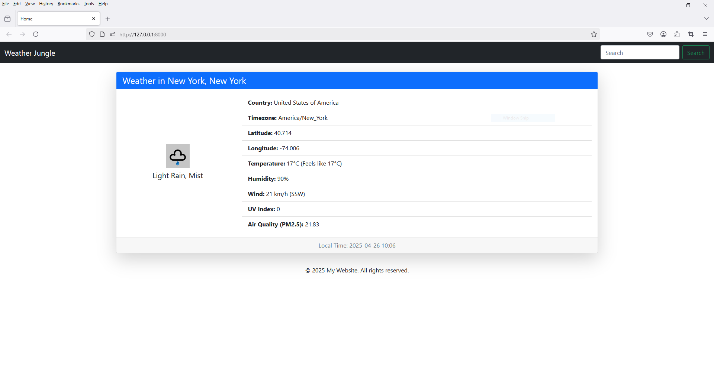
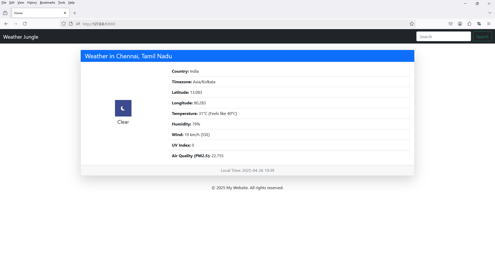

# dj_weather_report
 
```
https://weatherstack.com/
```

```commandline
python -m venv venv
```

```commandline
pip install django
```

```commandline
django-admin startproject config .
```

```
python manage.py startapp frontend
```

```
https://pypi.org/project/python-dotenv/
```

```
pip install python-dotenv
```

```commandline
pip install requests
```


